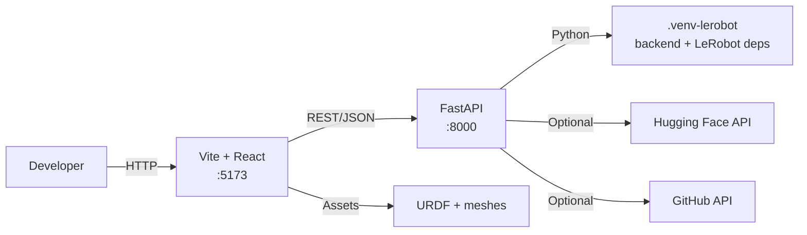
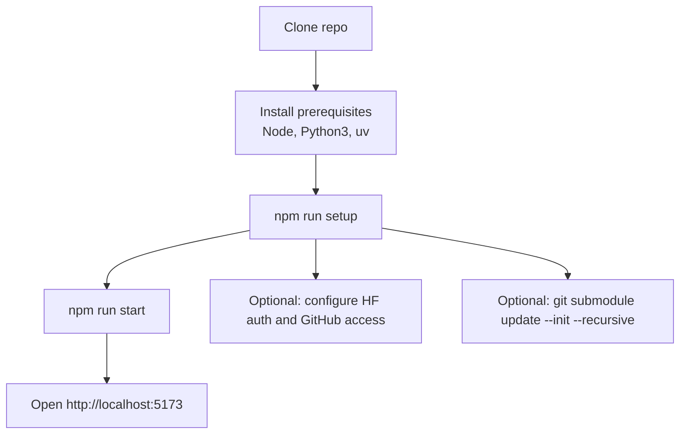
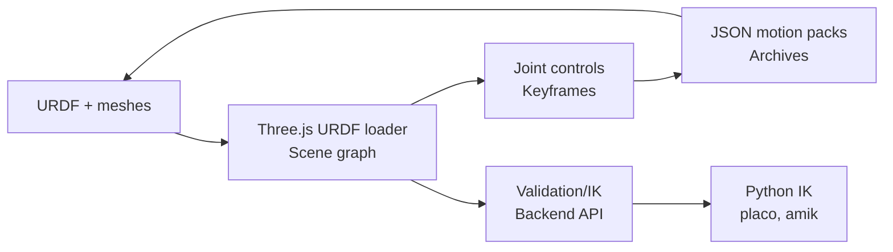
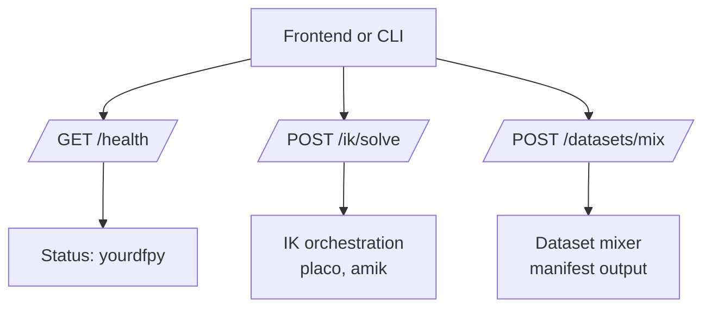

# URDF Studio

URDF Studio loads robot URDFs, lets you manipulate joints and keyframes, and replays LeRobot datasets or policies (v3 and v2.1).

## Prerequisites
- Node.js and npm
- Python 3
- `uv` (https://astral.sh/uv) for Python virtual environments
- Native teleoperation uses Rust toolchain (`cargo`, `rustc`)
- Build tools for native Python deps (Linux):
  ```bash
  sudo apt-get update
  sudo apt-get install python3-dev build-essential
  ```

## Setup
```bash
npm run setup
```

This prints a setup roadmap, installs npm dependencies, creates the unified Python environment at `.venv-lerobot`, and installs backend, training, OpenArm hardware, and validation Python deps, including Placo, LeRobot, `lerobot[feetech,damiao]`, `xoq-can`, `rerun-sdk`, MJLab, and MuJoCo-Warp.

Setup also provisions the sibling URDF Ops workspace from `git@github.com:amtellezfernandez/urdf-ops.git` and installs its npm dependencies. Override the checkout with `URDF_OPS_ROOT=/path/to/urdf-ops`, or skip this step with `URDF_STUDIO_SKIP_URDF_OPS_SETUP=1`.

Setup pins MuJoCo-Warp to the release that imports cleanly with the installed MuJoCo runtime.

After setup, the local `i-love-urdf` CLI is available in this repo via `npx ilu`. Install it globally with `npm run setup -- --install-global-ilu` when you want `ilu` on your shell `PATH`.

For GitHub access, the recommended path is `gh auth login`. URDF Studio can also reuse `GH_TOKEN` or `GITHUB_TOKEN`, and only needs a saved local token if you want a repo-specific fallback.

Install VGGT ("twin") dependencies:
```bash
npm install --twin
```

If you want the Quick Start sample (SO-ARM100), initialize the submodules:
```bash
git submodule update --init --recursive
```

## Run
```bash
npm run start
```

This starts:
- Frontend: `http://localhost:5173` (Vite + React)
- Backend API: `http://localhost:8000` (FastAPI)
- URDF Ops: `http://127.0.0.1:5174` with its API on `http://127.0.0.1:8001`
- Optional native world daemon: `http://localhost:8088` (`worldd`, currently from the `ikd/` runtime module path)

URDF Studio opens training links in the synchronized URDF Ops session. If URDF Ops is already running on the configured ports, Studio reuses it; otherwise Studio starts it. Set `URDF_STUDIO_SKIP_URDF_OPS_START=1` to launch Studio without managing Ops, or override the Ops URL with `URDF_OPS_WEB_URL`.

`npm run start` is now the safe local default and binds to loopback unless you override it. For phone/tunnel data mode, use:

```bash
npm run data
```

`npm run data` now requires an explicit acknowledgement because it can create a public URL into your local machine while the tunnel is active.
It also requires `URDF_SIMULATOR_API_TOKEN` and a manually installed `cloudflared` binary. Automatic `cloudflared` download is disabled.
The tunnel now exposes only the cam-to-sim session ingress, not the full backend API.
If the tunnel cannot be established, startup fails closed instead of silently degrading.

Ports and bind hosts can be overridden explicitly:

```bash
npm run start -- --web-port 3001 --api-port 9001
URDF_WEB_BIND_HOST=127.0.0.1 URDF_API_BIND_HOST=127.0.0.1 npm run start
```

Remote binds require an explicit opt-in:

```bash
npm run start -- --web-bind-host 0.0.0.0 --allow-remote --ack-remote-exposure
```

In interactive shells, risky paths will stop and ask for confirmation. In non-interactive environments, you must acknowledge them explicitly with flags or env vars:

```bash
URDF_STUDIO_ACK_PUBLIC_TUNNEL=1 npm run data
URDF_STUDIO_ACK_REMOTE_EXPOSURE=1 npm run start -- --web-bind-host 0.0.0.0 --allow-remote
```

Startup now also checks whether your checkout is behind the official `origin/main`. If it is, URDF Studio refuses to start and tells you to update first. For intentional pinned/custom runs, you can bypass that gate explicitly with:

```bash
npm run start -- --allow-outdated
URDF_STUDIO_ALLOW_OUTDATED=1 npm run start
```

For data mode:

```bash
export URDF_SIMULATOR_API_TOKEN='change-this-to-a-long-random-secret'
cloudflared --version
npm run data -- --ack-public-tunnel
```

For frontend-only development:
```bash
npm install
npm run dev
```

## Architecture


## Setup and Run Flow


## Data Flow


## Backend Endpoints


## Optional: Quick Start Sample (SO-ARM100)
```bash
git submodule update --init --recursive
```

Then click **Load SO-ARM100** in the Quick Start panel.

## Features
- Import a URDF folder (zip with meshes) into the viewer.
- Scrub joints, add keyframes, and build sequences.
- Record and export JSON motion packs or full archives; re-import to replay.

## Dev Tips
- `URDF_STUDIO_VERBOSE=1 npm run start` for verbose Vite + backend logs.
- `npm run start -- --help` shows runtime host/port and exposure options.
- `npm run smoke` runs lint + typecheck + dead-code check.
- `npm run architecture-check` enforces core loader centralization constraints.
- `npm run world:list` lists published world packages from backend registry.
- `npm run world:validate -- <manifest.json>` validates a world package manifest.
- `npm run world:publish -- <manifest.json>` publishes a world package manifest.
- Optional URDF Star hub publish:
  - `VITE_WORLD_HUB_API_BASE_URL=https://api.example.com`
  - `VITE_WORLD_HUB_WEB_BASE_URL=https://www.urdfstudio.com/worlds`
- `npm run world:bridge:conformance` runs strict schema/translation conformance checks.
- `npm run world:bridge:conformance:live` runs live Python-vs-worldd parity checks.
- `npm run world:bridge:benchmark` runs world-bridge latency/throughput benchmark with regression targets.
- `npm run perf:frontend:frame-gate` runs frontend world-frame latency gate checks.
- `npm run perf:gate` runs global performance gates (backend/runtime, frontend frame-time, and build duration).

## Docs
- [Docs index](docs/README.md)
- [Setup](docs/SETUP.md)
- [Teleoperation](docs/TELEOPERATION.md)
- [IKD API](docs/IKD_API.md)
- [IKD Architecture](docs/IKD_ARCHITECTURE.md)
- [WSP Spec v0.1](docs/specs/WSP_v0.1.md)
- [World Sharing Roadmap](docs/WORLD_SHARING_ROADMAP.md)
- [SoTA Commission Manipulation Plan](docs/SOTA_COMMISSION_MANIPULATION_PLAN.md)
- [Dev notes](docs/dev_notes.md)

### Deep-link import

URDF Studio can import a world package from URL params on load:

- `importWorldPackageUrl` (direct URL returning manifest or version record)
- or `importWorldPackageId` + `importWorldPackageVersion` (resolved via local registry API)

## License and Contributions
- Proprietary license: see [LICENSE](LICENSE)
- Contributions require written permission and a CLA: see [CLA.md](CLA.md)
- Contributing guidelines: see [CONTRIBUTING.md](CONTRIBUTING.md)
