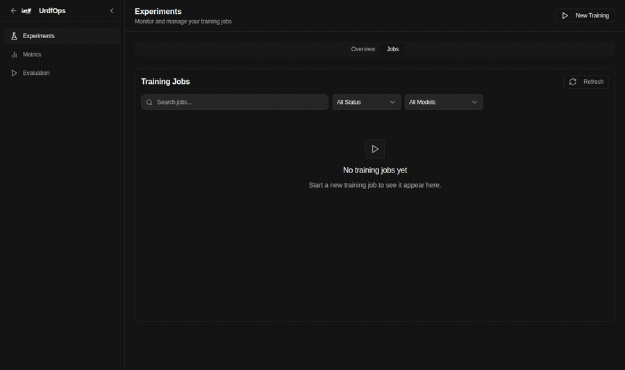

# URDF Studio

URDF Studio is a local robotics workbench for loading URDF robots, inspecting scene structure, editing joints and keyframes, replaying LeRobot episodes, and handing training workflows to the synchronized URDF Ops workspace.

Think of the app like a Blender-style robotics desktop: one command should open the full workspace, the UI should make the active robot/dataset/session obvious, and the docs should tell you what is running without making you reverse-engineer the stack.

## See It First

<p align="center">
  
</p>

One command opens the stack. One click loads a sample robot, scene objects, cameras, and replayable LeRobot episodes.

<table>
  <tr>
    <td width="50%">
      <strong>Blender-style robotics workspace</strong><br>
      Inspect the robot, joints, links, cameras, scene objects, and world context in one dense desktop surface.<br><br>
      
    </td>
    <td width="50%">
      <strong>Smooth episode replay</strong><br>
      Play dataset episodes, watch the robot move, and review the synchronized joint graph and replay cursor.<br><br>
      
    </td>
  </tr>
</table>

<p align="center">
  
</p>

Studio also hands off to the synchronized URDF Ops workspace for training and operations workflows.

## Start Here

```bash
cd ~/studio/urdf-studio
npm run setup
npm run start
```

Open:

- URDF Studio: `http://127.0.0.1:5173`
- URDF Ops: `http://127.0.0.1:5174`

Use `npm run start` for the real app. It starts the frontend, backend, and synchronized URDF Ops session. Use `npm run dev` only when you intentionally want the frontend without the backend.

## What Should Happen

After `npm run start`, the terminal prints a `Ready:` block. A healthy local run has:

- Studio frontend on `http://127.0.0.1:5173`
- Studio backend on `http://127.0.0.1:8000`
- URDF Ops frontend on `http://127.0.0.1:5174`
- URDF Ops backend on `http://127.0.0.1:8001`

Fast smoke test:

1. Open `http://127.0.0.1:5173`.
2. Click `Play Sample Motion`.
3. In `Episodes`, click the first episode play button once.
4. The button should change to pause, the frame counter should advance, and the graph cursor should move smoothly.

## Prerequisites

- Node.js and npm
- Python 3
- `uv` from <https://astral.sh/uv>
- Linux build tools for native Python dependencies:

```bash
sudo apt-get update
sudo apt-get install python3-dev build-essential
```

Native teleoperation and IK daemon development may also need Rust (`cargo`, `rustc`). Setup can install Rust automatically when the configured runtime needs it.

## Setup

```bash
npm run setup
```

Setup installs:

- npm dependencies for URDF Studio
- the Python environment at `.venv-lerobot`
- backend, LeRobot, OpenArm hardware, MJLab, MuJoCo/MJX, and validation dependencies
- the pinned Placo/Pinocchio collision stack used by OpenArm self-collision checks
- the local `i-love-urdf` CLI, available as `npx ilu`
- the sibling URDF Ops checkout at `../urdf-ops`, unless configured otherwise

On macOS, setup skips the Placo/Pinocchio collision stack by default because the pinned native libraries are not consistently relocatable across macOS Python environments. Force it only if you need those checks:

```bash
URDF_STUDIO_INSTALL_COLLISION_STACK=1 npm run setup
```

URDF Ops setup is intentionally reusable. If `../urdf-ops` already has dependencies, setup now skips the redundant install instead of silently running a long `npm ci`.

Useful setup options:

```bash
URDF_STUDIO_SKIP_URDF_OPS_SETUP=1 npm run setup
URDF_OPS_ROOT=/path/to/urdf-ops npm run setup
npm run setup -- --install-global-ilu
npm run setup -- --twin
```

## Run Modes

| Command | Use For | Starts Backend? | Starts URDF Ops? |
| --- | --- | --- | --- |
| `npm run start` | Normal local app | Yes | Yes, or reuses it |
| `npm run team` | Intentional same-Wi-Fi/Tailnet sharing | Yes | Yes, or reuses it |
| `npm run dev` | Frontend-only UI work | No | No |
| `npm run data` | Phone/tunnel data mode | Yes | Yes, plus restricted public ingress |
| `npm run start -- --help` | Runtime options | N/A | N/A |

If you run `npm run dev`, backend calls such as `/api/version`, `/api/ik/config`, and `/robot-mastering/*` can fail because the Python backend is not running. That is expected for frontend-only development. Use `npm run start` when you want the full product.

## Common Workflows

### Load The Sample Motion

1. Start the app with `npm run start`.
2. Click `Play Sample Motion`.
3. Use the `Episodes` panel to replay the sample trajectories.

### Load Your Own Robot

1. Use the `Robot` loader on the first screen.
2. Drop a URDF/Xacro folder, zip, or files with meshes.
3. Check the scene tree and joints panel after load.
4. Use `Reset Pose`, joint controls, and replay tools to inspect behavior.

### Replay Or Review Episodes

1. Load or record episodes.
2. Use the left `Episodes` list to choose an episode.
3. Use the inline episode graph to inspect frame, time, joint curves, and velocity/limit markers.
4. Use one-click play/pause to verify replay motion.

### Open Training Tools

Click `URDF Ops` in the top bar. Studio opens the synchronized URDF Ops session at `http://127.0.0.1:5174`.

## Troubleshooting

### Setup Looks Frozen At "Setting Up URDF Ops Workspace"

That step manages the sibling `../urdf-ops` checkout. If dependencies are missing, npm can take a while. Current setup prints the npm install command and streams output when an install is needed. If dependencies are already present, it should print:

```text
URDF Ops dependencies already installed
```

To skip URDF Ops setup temporarily:

```bash
URDF_STUDIO_SKIP_URDF_OPS_SETUP=1 npm run setup
```

### The UI Opens But API Calls Return 500

You probably started frontend-only mode:

```bash
npm run dev
```

Stop it and run the full stack:

```bash
npm run start
```

Check health:

```bash
curl http://127.0.0.1:8000/health
curl http://127.0.0.1:8001/health
```

### Port Already In Use

Choose explicit ports:

```bash
npm run start -- --web-port 3001 --api-port 9001
```

URDF Ops ports can be overridden:

```bash
URDF_OPS_WEB_PORT=5176 URDF_OPS_API_PORT=8003 npm run start
```

## Security Defaults

`npm run start` binds locally by default. For intentional collaboration, prefer the guarded team launcher:

```bash
npm run team
```

Raw non-loopback binds remain available for explicit advanced use and require acknowledgement:

```bash
npm run start -- --web-bind-host 0.0.0.0 --allow-remote --ack-remote-exposure
```

Phone/tunnel data mode also requires explicit acknowledgement and a local token:

```bash
export URDF_SIMULATOR_API_TOKEN='change-this-to-a-long-random-secret'
npm run data -- --ack-public-tunnel
```

## Documentation

- [User Guide](docs/USER_GUIDE.md) - first launch, UI map, workflows, and troubleshooting.
- [Setup Guide](docs/SETUP.md) - installation, launch modes, ports, tokens, and runtime checks.
- [Documentation Index](docs/README.md) - advanced operation guides and public file/session specs.

## Developer Checks

```bash
npm run lint
npm run typecheck
npm run test
npm run build
```

Focused checks:

```bash
npm run test -- web/src/features/dataset/episode-viewer/modalHelpers.test.ts
npm run test:backend -- backend/tests/test_datasets_service.py
```

## License And Contributions

- License: see [LICENSE](LICENSE)
- Contributions require written permission and a CLA: see [CLA.md](CLA.md)
- Contributing guidelines: see [CONTRIBUTING.md](CONTRIBUTING.md)
