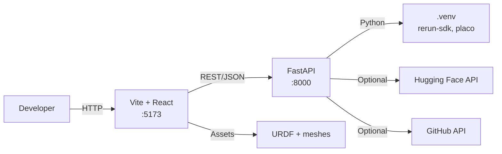
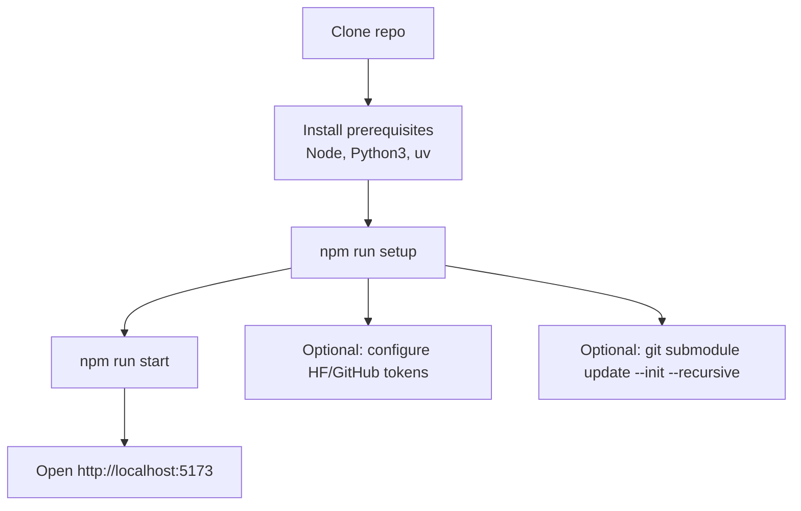
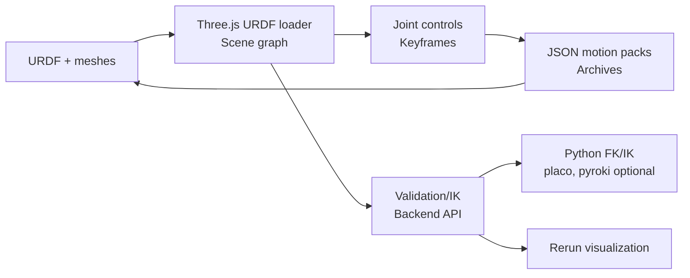
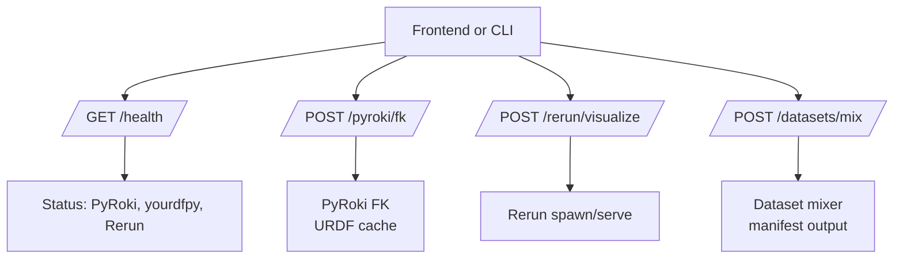

# URDF Studio

URDF Studio loads robot URDFs, lets you manipulate joints and keyframes, and replays LeRobot datasets or policies (v3 and v2.1).

## Prerequisites
- Node.js and npm
- Python 3
- `uv` (https://astral.sh/uv) for Python virtual environments
- Build tools for native Python deps (Linux):
  ```bash
  sudo apt-get update
  sudo apt-get install python3-dev build-essential
  ```

## Setup
```bash
npm run setup
```

This installs npm dependencies, creates a Python virtual environment, and installs the backend Python deps (Rerun SDK, Placo). It also prompts for optional Hugging Face and GitHub tokens.

If you want the Quick Start sample (SO-ARM100), initialize the submodules:
```bash
git submodule update --init --recursive
```

## Run
```bash
npm run start
```

This starts:
- Frontend: `http://localhost:5173` (Vite + React)
- Backend API: `http://localhost:8000` (FastAPI)

For frontend-only development:
```bash
npm install
npm run dev
```

## Architecture


## Setup and Run Flow


## Data Flow


## Backend Endpoints


## Optional: Quick Start Sample (SO-ARM100)
```bash
git submodule update --init --recursive
```

Then click **Load SO-ARM100** in the Quick Start panel.

## Features
- Import a URDF folder (zip with meshes) into the viewer.
- Scrub joints, add keyframes, and build sequences.
- Record and export JSON motion packs or full archives; re-import to replay.

## Dev Tips
- `URDF_STUDIO_VERBOSE=1 npm run start` for verbose Vite + backend logs.
- `npm run smoke` runs lint + typecheck + dead-code check.

## Docs
- [Docs index](docs/README.md)
- [Setup](docs/SETUP.md)
- [Teleoperation](docs/TELEOPERATION.md)
- [Dev notes](docs/dev_notes.md)
