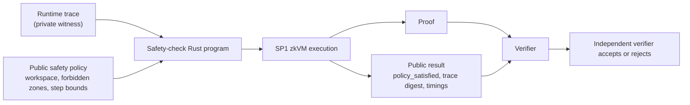
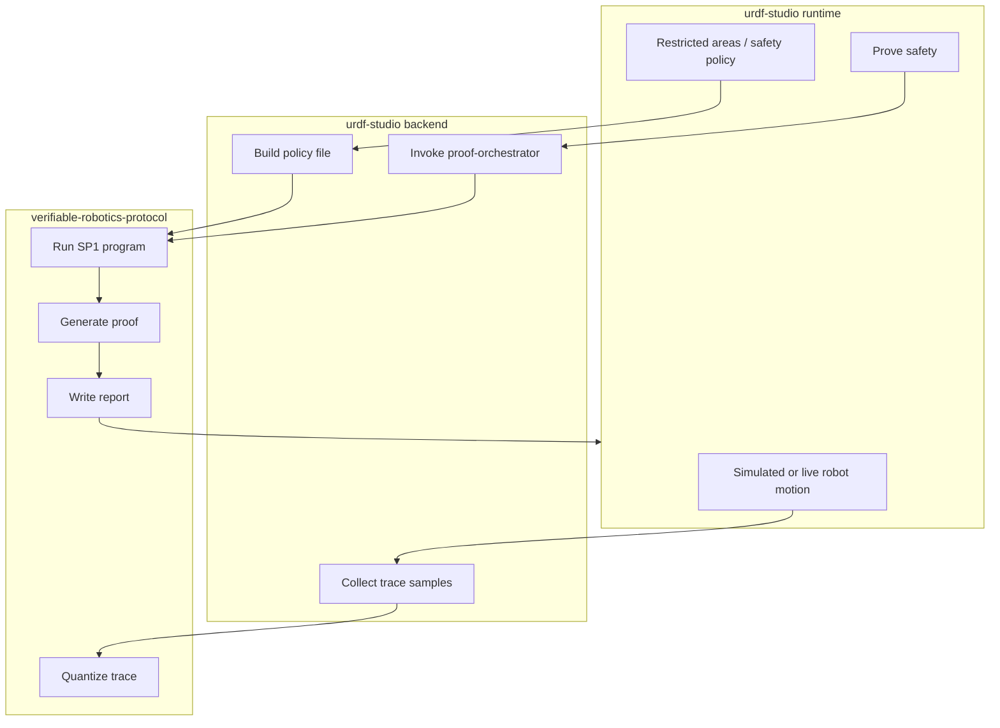

# Challenge 4: How SP1 Works in This Runtime

This document explains how **SP1** works in the context of the **Zero-Knowledge Proof of Safe Robot Execution** challenge and how it fits the current `urdf-studio` runtime integration.

---

## 1. What SP1 is

**SP1** is a zkVM, a **zero-knowledge virtual machine**.

That means:

- you write a normal program, typically in Rust
- the program runs on some input
- SP1 proves that the program really ran correctly
- the verifier checks the proof without seeing the private input

So instead of hand-writing a custom arithmetic circuit, you write a normal safety-checking program and let SP1 prove:

> "This program was executed correctly on some hidden witness."

---

## 2. What is being proven in Challenge 4

For this challenge, the hidden witness is the robot execution trace.

In our runtime flow, that trace is a sequence of 2D positions:

```text
(x_0, y_0), (x_1, y_1), ..., (x_n, y_n)
```

The public inputs are the safety policy:

- workspace bounds
- one or more restricted areas
- maximum allowed motion step
- optional maximum change in step size

So the final statement is:

> "There exists a private execution trace such that, when the SP1 safety-checking program runs on it, the public safety policy is satisfied."

Or in the failing case:

> "The proof run shows the execution violated the public safety policy."

---

## 3. The high-level SP1 flow



---

## 4. What the program actually checks

The SP1-side program does not need to know anything about:

- the robot brand
- the perception system
- the controller internals
- the camera stream

It only checks the safety property over the trace.

Typical checks:

1. **Workspace bounds**
   - every point must stay inside the allowed map rectangle

2. **Forbidden regions**
   - no point may enter any restricted area

3. **Step-size constraint**
   - the movement between consecutive samples must stay below a bound

4. **Optional step-delta bound**
   - the change between consecutive step sizes must stay below a bound

That means the proof is about **safe execution**, not about revealing the raw trajectory.

---

## 5. Why this is zero-knowledge

The verifier does **not** need to see:

- the full trajectory
- all sampled positions
- sensor logs
- planner state
- robot control internals

The verifier only sees:

- the proof
- the public policy
- public outputs such as:
  - `policy_satisfied`
  - `trace_digest_hex`
  - proving time

So the verifier learns:

- whether the execution satisfied the policy

but does **not** learn:

- the exact hidden trace itself

That is the privacy-preserving part of the challenge.

---

## 6. How it fits our runtime

In the current runtime integration:

1. the runtime records a 2D pose trace
2. the user defines a public safety policy
   - restricted areas
   - workspace
   - motion bounds
3. `urdf-studio` sends both to the backend
4. the backend calls the local `verifiable-robotics-protocol` repo
5. SP1 runs the safety-check program
6. runtime receives the proof result

So the architecture is:



---

## 7. What "prove" really means here

When the operator clicks `Prove safety`, the backend does not prove the entire robot software stack.

It proves one very specific claim:

> "The hidden execution trace satisfied the public safety policy under the SP1 safety-checking program."

This is important.

SP1 is proving the **correct execution of the safety-checking program** over the supplied witness.

It is **not** automatically proving:

- that the physical robot really followed reality
- that all sensors were honest
- that no one tampered with the trace source

Those are separate trust questions.

That is why this fits well with the rest of your project:

- **Challenge 2 / zRA** gives trust in device/runtime integrity
- **Challenge 4 / SP1** gives trust in private execution-policy compliance

Together they are much stronger than either one alone.

---

## 8. Why SP1 is a good fit for this challenge

SP1 is useful here because:

- it lets you write the safety check as normal code
- it is easier to iterate than a handwritten zk circuit
- it produces a real proof artifact
- it is a good match for "private trace, public policy"

This is exactly the pattern Challenge 4 is asking for.

---

## 9. What our current proof demonstrates

In the current runtime demo, we can prove properties such as:

- the robot stayed outside restricted areas
- the robot stayed within workspace bounds
- the robot respected motion step limits

And we can deliberately create a failing case with:

- entering a restricted area
- or using an overly aggressive speed profile

So the demo can show both:

- `Safe execution proved`
- `Non-permitted movement proved`

without revealing the full trajectory.

---

## 10. Practical caveat

The current runtime integration is simulation-first.

That means:

- demo mode generates the execution trace from simulated runtime motion
- later, hardware mode can replace that trace source with live robot pose

The proof pipeline itself does not need to change much.

Only the trace source changes:

- today: runtime simulation
- later: live ButterClaw / robot pose feed

This is why the current architecture is a good stepping stone from demo to hardware.

---

## 11. One-sentence explanation for judges

> SP1 lets us prove that a hidden robot execution trace satisfied a public safety policy, without revealing the trajectory itself.

