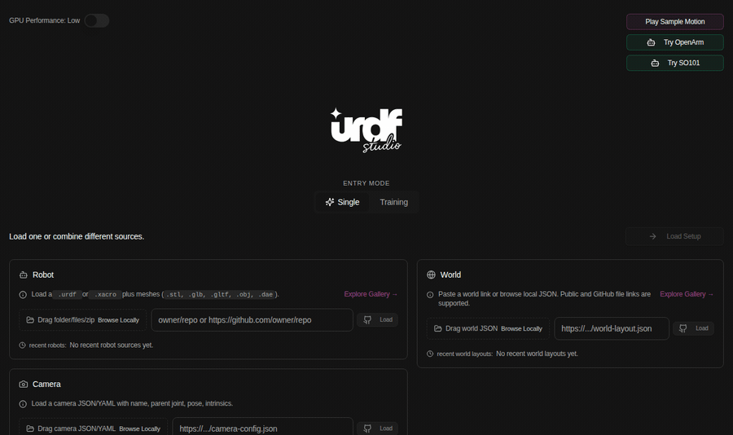
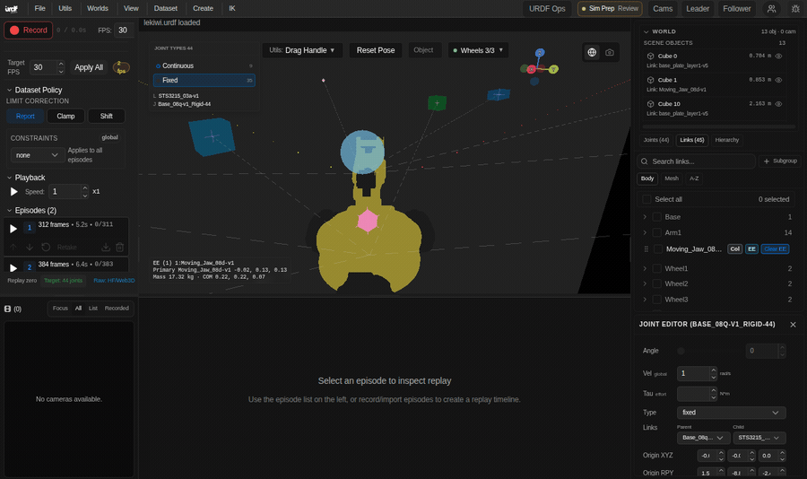
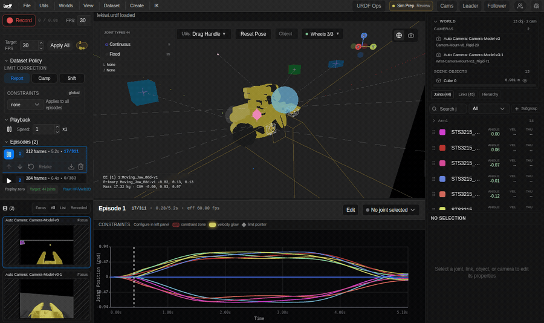

# URDF Studio User Guide

This guide explains how to launch URDF Studio, use the main workspace, and troubleshoot common user-facing problems.

## Mental Model

URDF Studio is a local robotics workspace. Start it with one command, then use the browser UI to load robots, inspect scenes, replay episodes, and share a session when needed.

The launcher manages the supporting local services for you. In normal use, you only need the Studio URL printed in the terminal.

## Visual Walkthrough

The fastest way to understand the product is to load the sample motion and watch how the UI fills in.

<p align="center">
  
</p>

The workspace is built for repeated robotics work: a 3D viewer in the center, dataset and playback controls on the left, and scene/joint detail on the right.

<p align="center">
  
</p>

Episode replay keeps the robot pose, frame counter, graph cursor, and joint curves synchronized.

<p align="center">
  
</p>

## First Launch

```bash
cd ~/studio/urdf-studio
npm run setup
npm run start
```

When startup is healthy, the terminal prints:

```text
Ready:
Open URDF Studio: http://127.0.0.1:5173
Access: only this laptop.
Sharing: localhost links work only on this computer.
```

Open the Studio URL in your browser.

## First Smoke Test

1. Open `http://127.0.0.1:5173`.
2. Click `Play Sample Motion`.
3. Wait for the sample robot to load.
4. In the `Episodes` panel, click the play button on episode `1`.
5. Confirm:
   - the play button changes to pause
   - the frame counter advances
   - the robot moves
   - the episode graph cursor moves smoothly

If this works, the viewer, dataset replay, graph overlay, and local launch are usable.

## Workspace Map

### Top Bar

- `File`, `Utils`, `Worlds`, `View`, `Dataset`, `Create`, `IK`: main action menus.
- `Sim Prep Review`: physics/readiness review state.
- `Cams`, `Leader`, `Follower`: camera and teleoperation setup.
- Share/action icons: session and collaboration controls.

### Left Sidebar

- `Record`: starts recording workflows.
- FPS and target FPS controls: runtime timing controls.
- Dataset policy and limit correction: how imported/replayed data is treated.
- `Playback`: global playback controls.
- `Episodes`: per-episode replay, retake, export, delete, and ordering.
- Replay zero mode: choose target robot zero pose or raw dataset pose.

### Center Viewer

- 3D robot/world view.
- Gizmos, object handles, scene objects, and camera controls.
- `Reset Pose` resets the active robot pose.
- Wheel/drive controls appear when the active robot supports them.

### Episode Graph

- Shows frame/time, effective FPS, selected signals, and replay cursor.
- Velocity/limit markers identify review problems.
- Edit mode exposes timeline and joint-curve editing tools.

### Right Sidebar

- World object list and scene hierarchy.
- Joint/link/object tabs.
- Active selection details.
- Joint values and runtime telemetry when available.

## Core Workflows

### Load A Robot

1. Start the app with `npm run start`.
2. In the first screen, use `Robot`.
3. Drop or browse for a URDF/Xacro folder, zip, or individual files.
4. Include meshes (`.stl`, `.glb`, `.gltf`, `.obj`, `.dae`) when the URDF references them.
5. Confirm the robot appears in the viewer and the joints list populates.

### Use The Built-In Sample

1. Click `Play Sample Motion`.
2. Use the episode list to play the first or second episode.
3. Watch the graph and 3D robot together. They should stay synchronized.

### Review Dataset Replay

1. Load a dataset or sample motion.
2. Choose replay zero mode:
   - `Target`: apply loaded target robot zero pose.
   - `Raw`: match the dataset visualizer convention.
3. Play one episode.
4. Check:
   - frame counter
   - elapsed time
   - graph cursor
   - velocity/limit markers
   - joint values in the right sidebar

### Share A Session

For same-network collaboration:

```bash
npm run team
```

Open the printed Team URL on the server laptop first. Use `Share` in the top bar, then send the generated collaboration link to the people who should join.

Use Share again to pause sharing, reset links, or change access.

## Command Reference

| Command | Meaning |
| --- | --- |
| `npm run setup` | Install dependencies and local runtime |
| `npm run start` | Start the local app |
| `npm run team` | Start a trusted-network team session |
| `npm run data` | Start phone/data workflow with tunnel acknowledgement |
| `npm run start -- --help` | Runtime options |

## Troubleshooting

### The App Does Not Open

Run:

```bash
npm run start
```

Then open the URL printed in the `Ready:` block.

### The UI Opens But Actions Fail

Start the app again from the launcher:

```bash
npm run start
```

### Port 5173 Is Busy

Use another app port:

```bash
npm run start -- --web-port 3001
```

### Teammates Cannot Connect

- Confirm everyone is on the same Wi-Fi/LAN/Tailnet.
- Confirm the Team URL uses the server laptop network address, not `localhost`.
- Retry with `npm run team -- --team-host <server-laptop-ip>`.
- Check local firewall prompts for Node.

### Sample Loads But Replay Does Not Move

- Use `npm run start`.
- Confirm the first episode button changes to pause.
- Confirm frame counters advance.
- Refresh the page and repeat the smoke test.

## Good Defaults

- Use `npm run start` for demos, verification, and real work.
- Keep remote sharing off unless you are intentionally sharing on a trusted network.
- Use the sample motion as the first regression check after playback changes.
